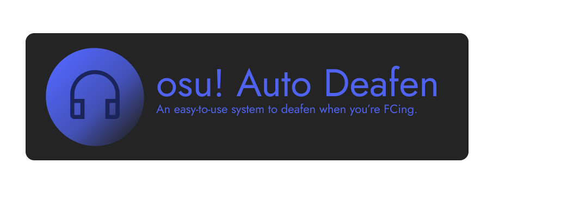

Powered by the popular tool, [GosuMemory](https://github.com/l3lackShark/gosumemory/), osu! Auto Deafen gives users an easy-to-use system for auto deafening you on Discord whenever you're about to FC a map.

# Usage
1. Download the [latest release](https://github.com/Nat3z/osuautodeafen/releases/latest) and unzip it.
1. In "config.ini" set the "username" field to your username on osu! 
1. Set your Discord Deafen keybind to ALT+D
1. Launch osu! 
1. After osu! has fully loaded, launch "osuautodeafen.exe" and wait for it to start.
1. You're all set!

> Please know that osu! Auto Deafen is still in development. Whenever we make major changes, you may need to manually update your config.ini

# This project uses:
* [https://github.com/gorilla/websocket](gorilla-websocket)
* [https://github.com/l3lackShark/gosumemory/](gosumemory!)